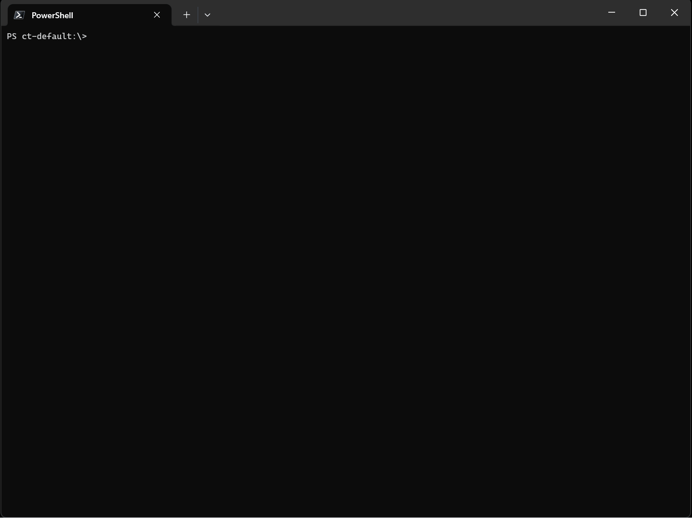
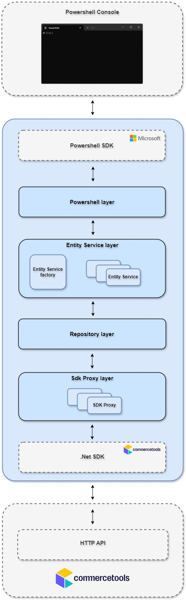

<h1 align="center">
   
  Powershell provider for Commercetools
   
</h1>

<h4 align="center">Gain command-line control over Commercetools with this PowerShell provider.</h4>

## About

This PowerShell provider for Commercetools lets you manage Commercetools entities directly from the command line,
including CRUD (Create, Read, Update, Delete) and other operations.

## Documentation

### Quick start

1. Install the provider from the PowerShell Gallery (see Installation paragraph below).
2. Open a PowerShell console session.
3. In Commercetools Merchant Center create a new API client.
4. Import the PowerShell module by entering:

   `Import-Module PSCommercetools.Provider`
5. Create a new PsDrive by entering:

   `New-PSDrive -PSProvider PSCommercetools
     -Name psct
     -Root psct
     -ProjectKey <XXXXX>
     -ClientId <XXXXX>
     -ClientSecret <XXXXX>
     -Scopes <XXXXX>`

   Replace `<XXXXX>` above with the data returned when creating the API client in step 3.
6. Validate everything is working by entering:

   `Get-ChildItem psct:\`

### Installation

The provider is available on the [PowerShell Gallery](https://www.powershellgallery.com/) through
[PowerShellGet](https://learn.microsoft.com/en-us/powershell/module/powershellget). To install it, run the following
command in a PowerShell console:

`Install-Module PSCommercetools.Provider`

#### Requirements

Because the provider runs on .Net 9.0 runtime, Powershell 7.5 or above is required.

### Supported entities

The following table shows the entities and operations that are currently supported by the provider.

| Entity            | create | read | update | delete |
|-------------------|--------|------|--------|--------|
| apiClient         | ✔️     | ✔️   | ❌      | ✔️     |
| attributeGroup    | ✔️     | ✔️   | ✔️     | ✔️     |
| businessUnit      | ✔️     | ✔️   | ✔️     | ✔️     |
| cart              | ✔️     | ✔️   | ✔️     | ✔️     |
| cartDiscount      | ✔️     | ✔️   | ✔️     | ✔️     |
| category          | ✔️     | ✔️   | ✔️     | ✔️     |
| channel           | ✔️     | ✔️   | ✔️     | ✔️     |
| customer          | ✔️     | ✔️   | ✔️     | ✔️     |
| custom object     | ✔️     | ✔️   | ✔️     | ✔️     |
| discount code     | ✔️     | ✔️   | ✔️     | ✔️     |
| inventory entry   | ✔️     | ✔️   | ✔️     | ✔️     |
| shipping method   | ✔️     | ✔️   | ✔️     | ✔️     |
| order             | ✔️     | ✔️   | ✔️     | ✔️     |
| payment           | ✔️     | ✔️   | ✔️     | ✔️     |
| payment method    | ✔️     | ✔️   | ✔️     | ✔️     |
| product           | ✔️     | ✔️   | ✔️     | ✔️     |
| product discount  | ✔️     | ✔️   | ✔️     | ✔️     |
| product selection | ✔️     | ✔️   | ✔️     | ✔️     |
| product type      | ✔️     | ✔️   | ✔️     | ✔️     |
| quote             | ❌      | ❌    | ❌      | ❌      |
| review            | ❌      | ❌    | ❌      | ❌      |
| shipping method   | ✔️     | ✔️   | ✔️     | ✔️     |
| shipping zone     | ✔️     | ✔️   | ✔️     | ✔️     |
| shopping list     | ✔️     | ✔️   | ✔️     | ✔️     |
| standalone price  | ✔️     | ✔️   | ✔️     | ✔️     |
| state             | ✔️     | ✔️   | ✔️     | ✔️     |
| store             | ✔️     | ✔️   | ✔️     | ✔️     |
| subscription      | ❌      | ❌    | ❌      | ❌      |
| tax category      | ✔️     | ✔️   | ✔️     | ✔️     |
| type              | ✔️     | ✔️   | ✔️     | ✔️     |

Omitted entities in the table above are not (yet) supported.

### Cmdlets

The provider support the following native cmdlets:

- [Get-ChildItem](docs/Get-ChildItem%20cmdlet.md)
- [Get-Item](docs/Get-Item%20cmdlet.md)
- [New-Item](docs/New-Item%20cmdlet.md)
- [Remove-Item](docs/Remove-Item%20cmdlet.md)
- [Test-Path](docs/Test-Path%20cmdlet.md)
- [Set-Location](docs/Set-Location%20cmdlet.md)
- [New-PsDrive](docs/New-PSDrive%20cmdlet.md)
- [Remove-PsDrive](docs/Remove-PSDrive%20cmdlet.md)

### Custom cmdlets

There are also a number of custom cmdlets specific to the Commercetools provider:

- [ConvertTo-CtJson](docs/ConvertTo-CtJson%20cmdlet.md)
- [Publish-Product](docs/Publish-Product%20cmdlet.md)
- [Unpublish-Product](docs/Unpublish-Product%20cmdlet.md)
- [Update-Item](docs/Update-Item%20cmdlet.md)

### Sample scripts

A couple of sample scripts are provided on the [samples](docs/script%20samples.md) page. These showcase some scenarios
that can be achieved with the provider.

## Technical overview

### Architecture

The provider is composed of different layers:

- **PowerShell layer**

  Implements the PowerShell Provider and cmdlets, exposing Commercetools resources as a hierarchical
  PSPath (e.g., psct:\products\{id}) and mapping standard cmdlets (Get-ChildItem, Get-Item, New-Item, Remove-Item, etc.)
  to provider operations.
- **Entity service layer**

  Translates provider requests into concrete operations (lookup by id/key, queries,
  create/update/delete), applies validation, expansion and paging,
  builds query predicates from PowerShell parameters, and normalizes results into provider-friendly objects for listing,
  navigation, and conversion to/from JSON.
- **Repository layer**

  Provides a thin, testable abstraction over the Commercetools API. Performs CRUD and query
  operations.
- **SDK proxy layer**

  Mostly generated adapters that present a uniform, generic surface over the Commercetools .NET SDK.
  Supplies endpoint facades and request/response wrappers

### Tools, sdks and technologies

- C#
- .Net 9 SDK
- Commercetools .NET SDK (v2)
- Roslyn code generation
- Xunit

### Unit tests

The test suite exercises the provider end-to-end inside an in-memory PowerShell runspace so cmdlets and provider
behavior are validated as a user would experience them.

The core utility is `TestHost` (see`PSCommercetools.Provider.Tests\Infrastructure\TestHost.cs`), which builds a minimal
DI container to wire up a HttpMessageHandler and the Commercetools SDK serialization.
This setup lets tests such as `ConvertToCtJsonTests` run scenarios like
`Get-ChildItem ct-test:\products\{id} | ConvertTo-CtJson`, validating both
provider I/O and JSON formatting without external network calls or environment dependencies.

### Dependency injection

The Microsoft PowerShell SDK does not natively support dependency injection. To be able to inject class instances
into the provider (especially for the unit tests), the provider uses a pattern suggested
[here](https://github.com/PowerShell/PowerShell/pull/17349#discussion_r873888306).

### Sync to async

The Microsoft PowerShell SDK operates synchronously, while the Commercetools .NET SDK is fully asynchronous. This
difference in design introduces a technical challenge: invoking asynchronous methods from synchronous entry points. In
typical .NET applications, blocking on asynchronous operations (e.g., by calling `.Result` or `.Wait()`) can lead to
deadlocks. This occurs when the calling thread holds a synchronization context that the asynchronous continuation
attempts to marshal back onto, resulting in both threads waiting indefinitely on each other.

However, the Commercetools .NET SDK mitigates this issue by consistently applying `ConfigureAwait(false)` in its
asynchronous methods. This instructs the runtime not to capture or resume on the original synchronization context,
allowing safe synchronous blocking. Consequently, it is safe to invoke Commercetools SDK operations from synchronous
PowerShell code using `GetAwaiter().GetResult()` without risk of deadlock.

### Build

To build the source locally, you need the following:

- The .NET SDKs for .NET 9.0.
- Visual Studio, JetBrains Rider or Visual Studio Code with the C# DevKit

A debugging session can be started by setting a breakpoint in your IDE and attaching it to the PowerShell process.

## Support

- [Github Sponsors](https://github.com/sponsors/randalvs)
- [Buy me a coffee](https://coff.ee/randalvs)

## License

This project is licensed under the MIT License - see the [LICENSE](LICENSE) file for details.
